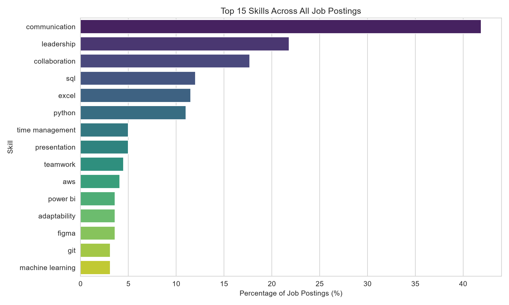
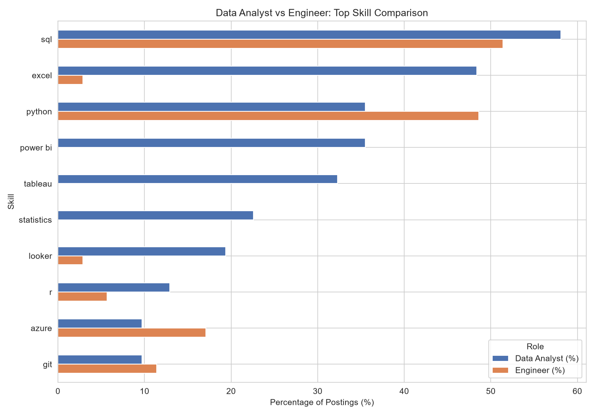
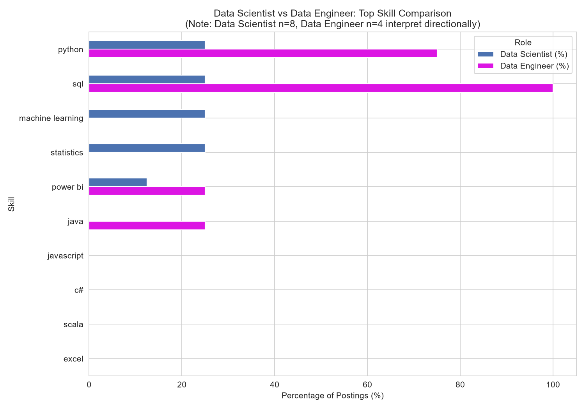

# Job Market Skill Analysis

A data analysis project examining which technical and soft skills appear most 
frequently across remote job postings, and how skill demand varies by role.

## Problem

What skills are most in-demand across today's remote job market, and how does 
that demand differ between roles like Data Analyst, Data Scientist, and 
Engineer? This project scrapes real job postings, extracts mentioned skills 
using keyword matching, and analyzes frequency patterns to answer that question 
— going beyond just data roles to compare skill demand across the broader job 
market.

## Data Source

Job postings were collected from **[RemoteOK](https://remoteok.com)** via 
their official public JSON API (`remoteok.com/api`), rather than scraping 
sites like LinkedIn or Indeed. This was a deliberate choice: RemoteOK 
explicitly provides this feed for public use, avoiding the ethical and legal 
gray areas of scraping sites that prohibit it in their Terms of Service. Per 
RemoteOK's usage terms, this project credits RemoteOK as the data source, and 
all job links in the dataset point back directly to the original RemoteOK 
posting.

Postings were collected across six tag categories to capture a broad job-market 
snapshot, not just data roles: `data`, `python`, `sql`, `marketing`, `design`, 
`product`.

## Tools

- **Python** — core language
- **requests** — fetching data from RemoteOK's REST API
- **BeautifulSoup** — parsing and cleaning HTML-formatted job descriptions
- **Pandas** — data cleaning, transformation, and skill-frequency analysis
- **Matplotlib / Seaborn** — visualization
- **Jupyter Notebook** — analysis environment

## Pipeline

1. **Scraping** — Fetched job listings from RemoteOK's public API across 6 
   job-category tags, with a 2-second delay between requests. Job descriptions 
   (returned as raw HTML) were cleaned into plain text using BeautifulSoup.
2. **Cleaning** — Removed duplicate postings, handled missing values 
   (52/418 postings, ~12%, had no location listed — filled as "Not specified" 
   rather than dropped), fixed unescaped HTML entities in job titles 
   (e.g. `&amp;` → `&`), and filtered out a small number of non-English/garbage 
   listings.
3. **Skill extraction** — Matched job descriptions against a manually curated 
   list of ~30 technical skills (Python, SQL, Excel, AWS, etc.) and 10 soft 
   skills (communication, leadership, etc.) using word-boundary regex matching 
   to avoid false positives (e.g. preventing "r" from matching inside "for").
4. **Role classification** — Categorized job titles into role groups 
   (Data Analyst, Engineer, Data Scientist, Product, etc.) using ordered 
   keyword matching, to enable skill comparisons across roles.
5. **Analysis & visualization** — Computed skill frequency percentages overall 
   and by role, and built comparison charts across role pairs.

## Key Insights

1. **Soft skills outrank technical skills in overall frequency** — 
   "communication" appeared in 41.9% of all postings, more than triple the 
   top technical skill, SQL (12.0%). This reflects the dataset's mix of 
   non-technical roles (Product, Marketing, Administrative, Operations) 
   alongside technical ones.

   

2. **Excel is Analyst-specific, not general** — 48.4% of Data Analyst 
   postings mentioned Excel vs just 2.9% of Engineer postings, the largest 
   skill gap found between the two roles.

3. **BI/visualization tools cluster almost entirely around Analyst roles** — 
   Power BI (35.5%), Tableau (32.3%), and Looker (19.4%) each appeared in 
   roughly a third of Data Analyst postings, but at or near 0% for Engineers, 
   confirming dashboarding tools are analyst-specific rather than general 
   data-role skills.

   

4. **Python is more evenly spread than SQL across technical roles** — 
   Python appeared in 35.5% of Analyst postings vs 48.6% of Engineer postings 
   (a modest gap), while SQL, the single most common skill overall, showed a 
   smaller Analyst-to-Engineer gap (58.1% vs 51.4%) than Excel or BI tools did.

5. **Directional signal only, small sample** — among the limited Data 
   Engineer (n=4) and Data Scientist (n=8) postings collected, SQL and Python 
   appeared in 100% and 75% of Data Engineer listings respectively, vs 25% 
   each for Data Scientist. Given the small sample size, this is a hint worth 
   further investigation, not a confident conclusion.

   

6. **The dataset skews toward non-technical and generalist roles** — of 418 
   postings, "Other" (unclassified) was the largest single bucket at 33% 
   (139 postings), followed by Product (41) and Designer (35), while 
   data-specific roles (Analyst, Scientist, Engineer combined) made up only 
   about 17% of the dataset. This reflects the mixed scraping tags used 
   (data, python, sql, marketing, design, product) and should be kept in mind 
   when generalizing these findings specifically to "the data job market."

## Reflection

This project reinforced that data cleaning and validation take up far more 
time than the analysis itself — issues like unescaped HTML entities, 
non-English postings, and an initial 62% "Other" role-classification rate all 
had to be caught and fixed before the numbers could be trusted. It also 
highlighted the importance of checking sample sizes before drawing conclusions 
— several role categories (Data Scientist, Data Engineer) were too small to 
support strong claims, and reporting that limitation honestly felt more 
valuable than hiding it. With more time, I'd expand the scraping to pull a 
larger and more balanced sample across role categories, and potentially pull 
from a second job board to cross-validate findings.

## Project Structure

````
IBM-Python-Data-Analysis-Project/
├── data/
│   ├── raw_data.csv
│   ├── cleaned_data.csv
│   └── skills_data.csv
├── notebooks/
│   └── analysis.ipynb
├── src/
│   └── scraper.py
├── visuals/
│   ├── top_skills_overall.png
│   ├── top_technical_skills.png
│   ├── analyst_vs_engineer.png
│   ├── analyst_vs_scientist.png
│   ├── scientist_vs_data_engineer.png
│   └── technical_vs_soft_by_role.png
├── README.md
└── requirements.txt
````